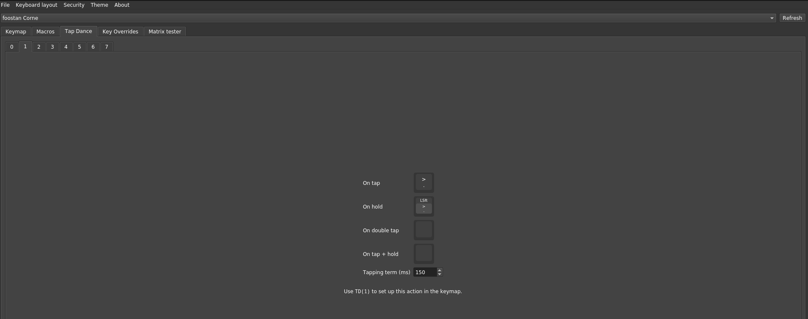

#  Personal Keyboard Layout for Coding: **CRKBD Cherry V3** 

This is my customize layout design spesicifically for my daily job as a software engineer

> [!WARNING]  
> Please read the keyboard specification before compile and flash the firmware to your MCU 

## Keyboard spesification
- **PCB**: Corne Cherry V3
- **Microcontroller**: [ATmega32u4](https://www.microchip.com/en-us/product/atmega32u4#Documentation)

## Keyboard Layout





## How to compile

### Build firmware using QMK
1. Build the firmware, (this is usig QMK)
```console
qmk compile -kb <keyboard> -km <keymap>
```

2. Flash the firmware to the keyboard 
```console
qmk compile -kb <keyboard> -km <keymap>
```

### Load `*.vil` file from [ VIAL ](https://get.vial.today/)
1. Download VIAL, run the program
2. Import `defaultcode.vil`


